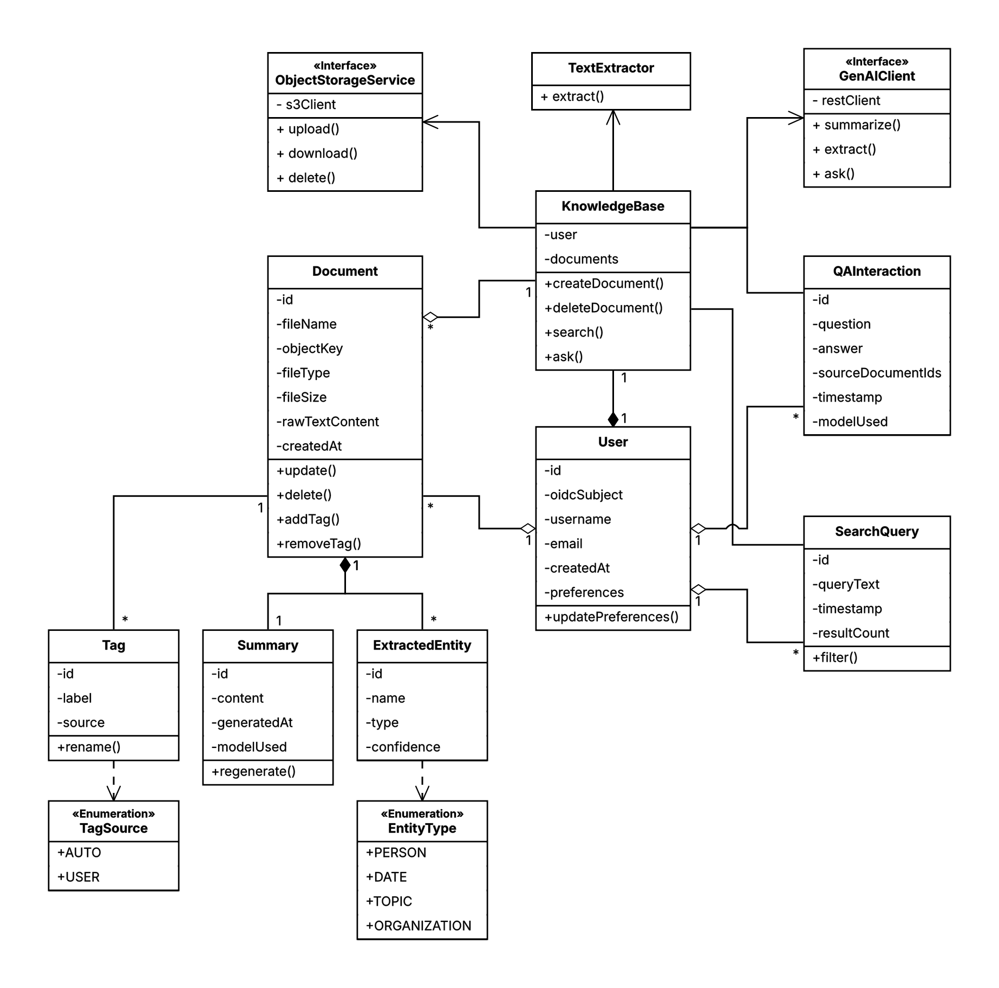
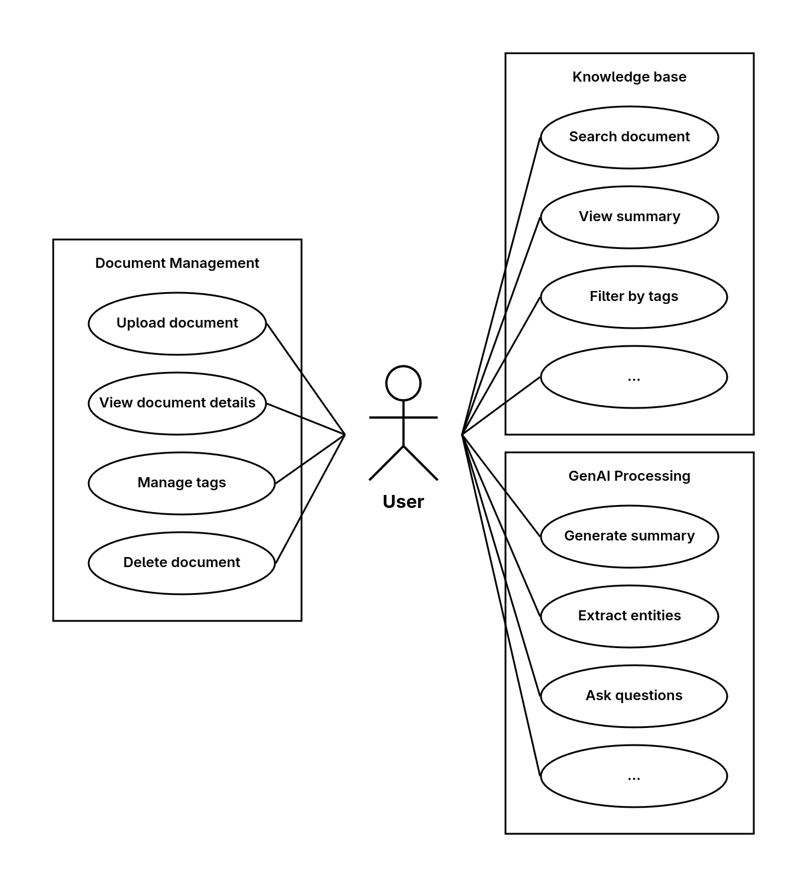
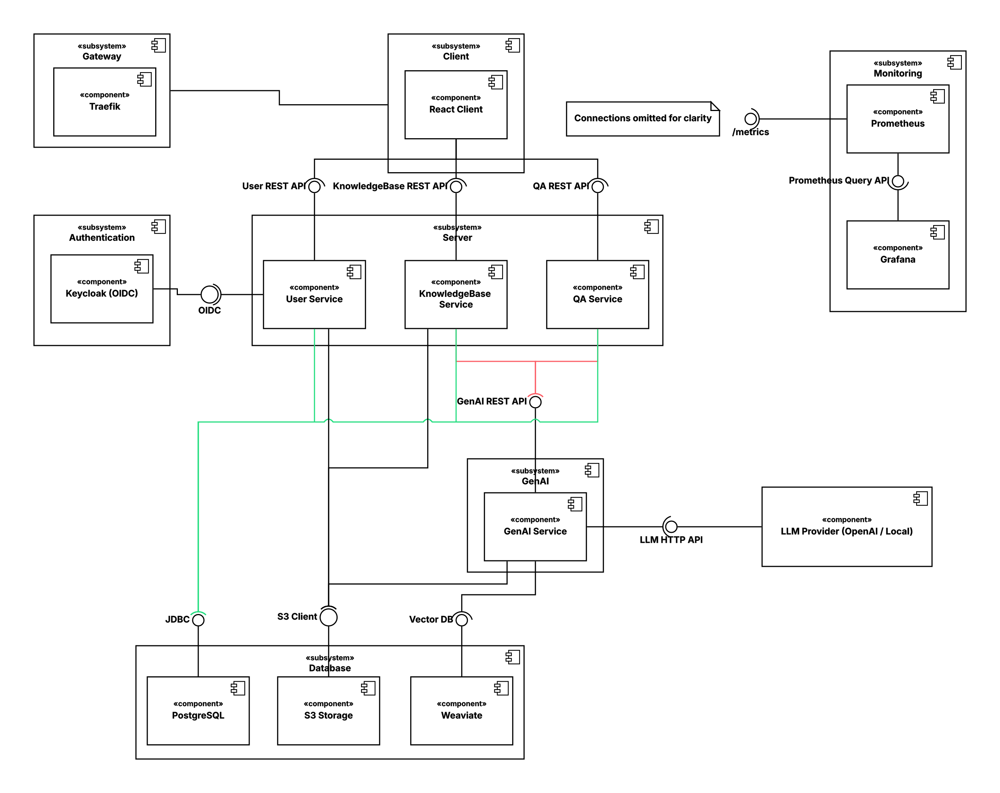

# System Overview and Architecture

## 1. Initial System Structure

### Server: Spring Boot REST API

The server side consists of three Spring Boot microservices:

1. User Service
    - Handles user registration, login, and authentication (JWT-based)
    - Manages user settings/preferences
    - Provides endpoints for session management
    - Database schema: `users`

2. Document Management Service
    - Manages document lifecycle (upload, process, update, delete)
    - Handles document storage and retrieval
    - Stores document metadata (title, upload date, file size etc.)
    - Triggers the GenAI service for summarization and entity extraction
    - Database schema: `documents`

3. Search and Indexing Service
    - Manages document tags (auto-generated as well as user-defined)
    - Performs search queries across the knowledge base
    - Generates answers to natural language questions based on the knowledge base
    - Provides filtered browsing and full-text search
    - Database schema: `search`

All services communicate via REST over HTTP. All endpoints are documented by an OpenAPI spec.

Team member responsible for this subsystem: Niklas Ladurner

### Client: React frontend

The client is a React application that provides:
- Dashboard with document tree, tags and file metadata
- Document upload interface (drag-and-drop, file picker)
- Document detail view showing full content, summary, extracted entities, and metadata
- Search bar with filtering
- Q&A interface for asking natural language questions about uploaded documents
- User authentication (login, registration)

Team member responsible for this subsystem: Bjarne Hansen

### GenAI Service: Python

The GenAI service is an independent Python microservice that handles all AI-related processing:
- Provides an endpoint that accepts document contents and returns a concise summary
- Provides an endpoint that accepts document contents and extracts structured entities (dates, names etc.)
- Provides an endpoint that accepts user questions in natural language and returns an answer based on data in the knowledge base. Also provides backlinks to source documents.

The GenAI service supports both cloud-based models (OpenAI API) and local models (GPT4All, LLaMA) via configuration. The active model provider is selected through environment variables so switching between cloud and local requires no code changes.

For the RAG pipeline, document chunks are stored in Weaviate (vector database). When a user asks a question, relevant chunks are retrieved and then passed as context to the LLM for answer generation.

Team member responsible for this subsystem: Dominic Prinz

### Database: PostgreSQL

The database consists of a single PostgreSQL instance with schema separation for each microservice:
- `users`: user accounts, credentials, preferences
- `documents`: file metadata, summaries, entities
- `search`: tags, categories, index data

Team member responsible for this subsystem: Niklas Ladurner

### Vector Database: Weaviate

The Weaviate database stores document chunk embeddings for semantic search. Runs as a separate container, accessed by the GenAI service over HTTP.

Team member responsible for this subsystem: Dominic Prinz

### Monitoring (Prometheus)

For monitoring the microservices, Prometheus is used to scrape metrics. These are then visualized using Grafana.

## UML Diagrams

### Analysis Object Model

### Use Case Diagram

### Top-Level Architecture (UML Component Diagram)

## 2. First Product Backlog

See GitHub Project.
